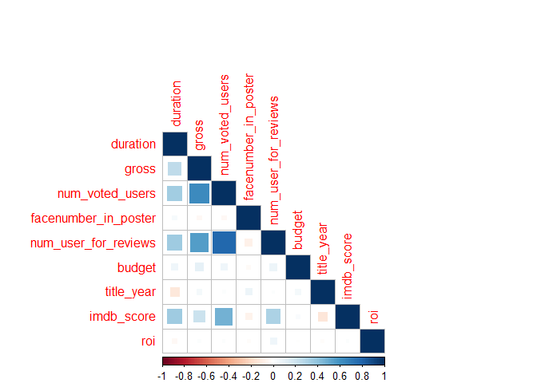
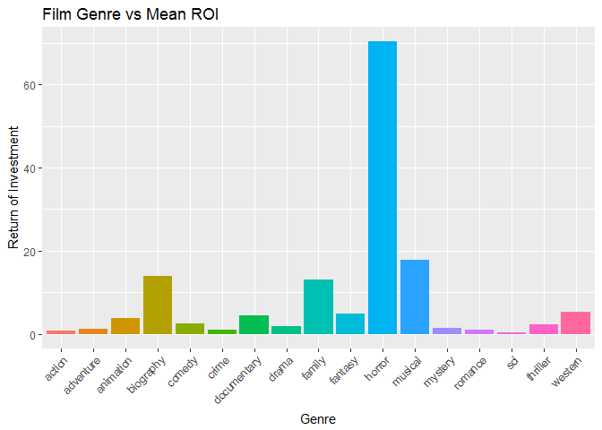
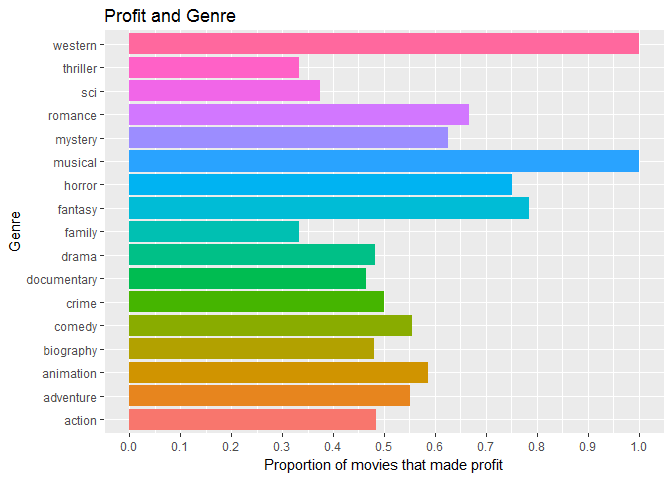
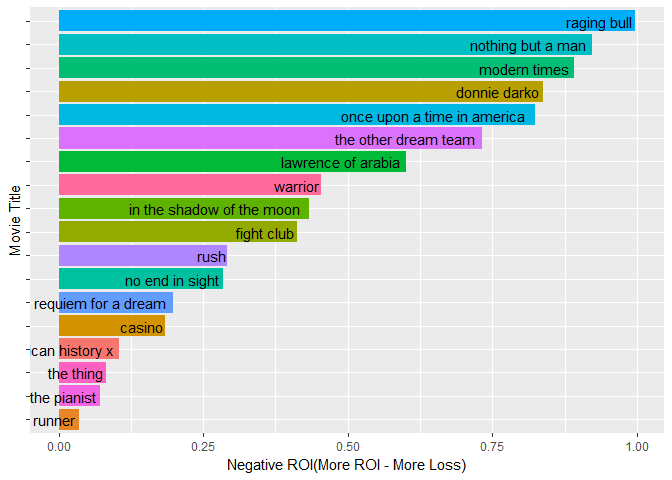
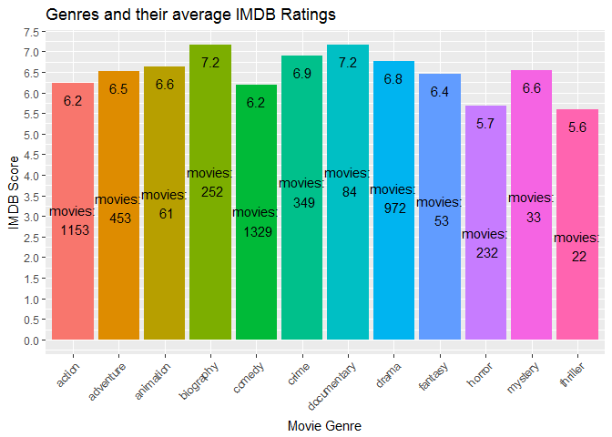

IMDB Data Analysis
================

Load libraries
--------------

``` r
library(ggplot2)
library(dplyr)
library(stringr)
library(corrplot)
```

Get data and look at its structure
----------------------------------

``` r
imdb <- read.csv("movie_metadata.csv", stringsAsFactors =  F, na.strings = c("", NA))
str(imdb)
```

    ## 'data.frame':    5043 obs. of  28 variables:
    ##  $ color                    : chr  "Color" "Color" "Color" "Color" ...
    ##  $ director_name            : chr  "James Cameron" "Gore Verbinski" "Sam Mendes" "Christopher Nolan" ...
    ##  $ num_critic_for_reviews   : int  723 302 602 813 NA 462 392 324 635 375 ...
    ##  $ duration                 : int  178 169 148 164 NA 132 156 100 141 153 ...
    ##  $ director_facebook_likes  : int  0 563 0 22000 131 475 0 15 0 282 ...
    ##  $ actor_3_facebook_likes   : int  855 1000 161 23000 NA 530 4000 284 19000 10000 ...
    ##  $ actor_2_name             : chr  "Joel David Moore" "Orlando Bloom" "Rory Kinnear" "Christian Bale" ...
    ##  $ actor_1_facebook_likes   : int  1000 40000 11000 27000 131 640 24000 799 26000 25000 ...
    ##  $ gross                    : int  760505847 309404152 200074175 448130642 NA 73058679 336530303 200807262 458991599 301956980 ...
    ##  $ genres                   : chr  "Action|Adventure|Fantasy|Sci-Fi" "Action|Adventure|Fantasy" "Action|Adventure|Thriller" "Action|Thriller" ...
    ##  $ actor_1_name             : chr  "CCH Pounder" "Johnny Depp" "Christoph Waltz" "Tom Hardy" ...
    ##  $ movie_title              : chr  "Avatar " "Pirates of the Caribbean: At World's End " "Spectre " "The Dark Knight Rises " ...
    ##  $ num_voted_users          : int  886204 471220 275868 1144337 8 212204 383056 294810 462669 321795 ...
    ##  $ cast_total_facebook_likes: int  4834 48350 11700 106759 143 1873 46055 2036 92000 58753 ...
    ##  $ actor_3_name             : chr  "Wes Studi" "Jack Davenport" "Stephanie Sigman" "Joseph Gordon-Levitt" ...
    ##  $ facenumber_in_poster     : int  0 0 1 0 0 1 0 1 4 3 ...
    ##  $ plot_keywords            : chr  "avatar|future|marine|native|paraplegic" "goddess|marriage ceremony|marriage proposal|pirate|singapore" "bomb|espionage|sequel|spy|terrorist" "deception|imprisonment|lawlessness|police officer|terrorist plot" ...
    ##  $ movie_imdb_link          : chr  "http://www.imdb.com/title/tt0499549/?ref_=fn_tt_tt_1" "http://www.imdb.com/title/tt0449088/?ref_=fn_tt_tt_1" "http://www.imdb.com/title/tt2379713/?ref_=fn_tt_tt_1" "http://www.imdb.com/title/tt1345836/?ref_=fn_tt_tt_1" ...
    ##  $ num_user_for_reviews     : int  3054 1238 994 2701 NA 738 1902 387 1117 973 ...
    ##  $ language                 : chr  "English" "English" "English" "English" ...
    ##  $ country                  : chr  "USA" "USA" "UK" "USA" ...
    ##  $ content_rating           : chr  "PG-13" "PG-13" "PG-13" "PG-13" ...
    ##  $ budget                   : num  2.37e+08 3.00e+08 2.45e+08 2.50e+08 NA ...
    ##  $ title_year               : int  2009 2007 2015 2012 NA 2012 2007 2010 2015 2009 ...
    ##  $ actor_2_facebook_likes   : int  936 5000 393 23000 12 632 11000 553 21000 11000 ...
    ##  $ imdb_score               : num  7.9 7.1 6.8 8.5 7.1 6.6 6.2 7.8 7.5 7.5 ...
    ##  $ aspect_ratio             : num  1.78 2.35 2.35 2.35 NA 2.35 2.35 1.85 2.35 2.35 ...
    ##  $ movie_facebook_likes     : int  33000 0 85000 164000 0 24000 0 29000 118000 10000 ...

``` r
summary(imdb)
```

    ##     color           director_name      num_critic_for_reviews
    ##  Length:5043        Length:5043        Min.   :  1.0         
    ##  Class :character   Class :character   1st Qu.: 50.0         
    ##  Mode  :character   Mode  :character   Median :110.0         
    ##                                        Mean   :140.2         
    ##                                        3rd Qu.:195.0         
    ##                                        Max.   :813.0         
    ##                                        NA's   :50            
    ##     duration     director_facebook_likes actor_3_facebook_likes
    ##  Min.   :  7.0   Min.   :    0.0         Min.   :    0.0       
    ##  1st Qu.: 93.0   1st Qu.:    7.0         1st Qu.:  133.0       
    ##  Median :103.0   Median :   49.0         Median :  371.5       
    ##  Mean   :107.2   Mean   :  686.5         Mean   :  645.0       
    ##  3rd Qu.:118.0   3rd Qu.:  194.5         3rd Qu.:  636.0       
    ##  Max.   :511.0   Max.   :23000.0         Max.   :23000.0       
    ##  NA's   :15      NA's   :104             NA's   :23            
    ##  actor_2_name       actor_1_facebook_likes     gross          
    ##  Length:5043        Min.   :     0         Min.   :      162  
    ##  Class :character   1st Qu.:   614         1st Qu.:  5340988  
    ##  Mode  :character   Median :   988         Median : 25517500  
    ##                     Mean   :  6560         Mean   : 48468408  
    ##                     3rd Qu.: 11000         3rd Qu.: 62309438  
    ##                     Max.   :640000         Max.   :760505847  
    ##                     NA's   :7              NA's   :884        
    ##     genres          actor_1_name       movie_title       
    ##  Length:5043        Length:5043        Length:5043       
    ##  Class :character   Class :character   Class :character  
    ##  Mode  :character   Mode  :character   Mode  :character  
    ##                                                          
    ##                                                          
    ##                                                          
    ##                                                          
    ##  num_voted_users   cast_total_facebook_likes actor_3_name      
    ##  Min.   :      5   Min.   :     0            Length:5043       
    ##  1st Qu.:   8594   1st Qu.:  1411            Class :character  
    ##  Median :  34359   Median :  3090            Mode  :character  
    ##  Mean   :  83668   Mean   :  9699                              
    ##  3rd Qu.:  96309   3rd Qu.: 13756                              
    ##  Max.   :1689764   Max.   :656730                              
    ##                                                                
    ##  facenumber_in_poster plot_keywords      movie_imdb_link   
    ##  Min.   : 0.000       Length:5043        Length:5043       
    ##  1st Qu.: 0.000       Class :character   Class :character  
    ##  Median : 1.000       Mode  :character   Mode  :character  
    ##  Mean   : 1.371                                            
    ##  3rd Qu.: 2.000                                            
    ##  Max.   :43.000                                            
    ##  NA's   :13                                                
    ##  num_user_for_reviews   language           country         
    ##  Min.   :   1.0       Length:5043        Length:5043       
    ##  1st Qu.:  65.0       Class :character   Class :character  
    ##  Median : 156.0       Mode  :character   Mode  :character  
    ##  Mean   : 272.8                                            
    ##  3rd Qu.: 326.0                                            
    ##  Max.   :5060.0                                            
    ##  NA's   :21                                                
    ##  content_rating         budget            title_year  
    ##  Length:5043        Min.   :2.180e+02   Min.   :1916  
    ##  Class :character   1st Qu.:6.000e+06   1st Qu.:1999  
    ##  Mode  :character   Median :2.000e+07   Median :2005  
    ##                     Mean   :3.975e+07   Mean   :2002  
    ##                     3rd Qu.:4.500e+07   3rd Qu.:2011  
    ##                     Max.   :1.222e+10   Max.   :2016  
    ##                     NA's   :492         NA's   :108   
    ##  actor_2_facebook_likes   imdb_score     aspect_ratio  
    ##  Min.   :     0         Min.   :1.600   Min.   : 1.18  
    ##  1st Qu.:   281         1st Qu.:5.800   1st Qu.: 1.85  
    ##  Median :   595         Median :6.600   Median : 2.35  
    ##  Mean   :  1652         Mean   :6.442   Mean   : 2.22  
    ##  3rd Qu.:   918         3rd Qu.:7.200   3rd Qu.: 2.35  
    ##  Max.   :137000         Max.   :9.500   Max.   :16.00  
    ##  NA's   :13                             NA's   :329    
    ##  movie_facebook_likes
    ##  Min.   :     0      
    ##  1st Qu.:     0      
    ##  Median :   166      
    ##  Mean   :  7526      
    ##  3rd Qu.:  3000      
    ##  Max.   :349000      
    ## 

Clean data
----------

``` r
# all characters to lower case
imdb$director_name <- tolower(imdb$director_name)
imdb$actor_2_name <- tolower(imdb$actor_2_name)
imdb$genres <- tolower(imdb$genres)
imdb$actor_1_name <- tolower(imdb$actor_1_name)
imdb$movie_title <- tolower(imdb$movie_title)
imdb$actor_3_name <- tolower(imdb$actor_3_name)
imdb$plot_keywords <- tolower(imdb$plot_keywords)

# extract the base genre of the film.
# if the film's genre is Action|Crime|Drama|Horror then it base genre will be Action.
imdb$base_genre <- str_extract(imdb$genres, pattern = "^[a-zA-Z]*")
imdb$base_genre <- factor(imdb$base_genre)
table(imdb$base_genre)
```

    ## 
    ##      action   adventure   animation   biography      comedy       crime 
    ##        1153         453          61         252        1329         349 
    ## documentary       drama      family     fantasy        film        game 
    ##          84         972          11          53           1           1 
    ##     history      horror       music     musical     mystery     romance 
    ##           1         232           1           4          33           6 
    ##         sci    thriller     western 
    ##          13          22          12

``` r
imdb$color <- factor(imdb$color)
imdb$language <- factor(imdb$language)
imdb$country <- factor(imdb$country)
imdb$content_rating <- factor(imdb$content_rating)

# remove features
imdb$movie_imdb_link <- NULL
imdb$plot_keywords <- NULL
imdb$num_critic_for_reviews <- NULL
imdb$director_facebook_likes <- NULL
imdb$actor_3_facebook_likes <- NULL
imdb$actor_1_facebook_likes <- NULL
imdb$cast_total_facebook_likes <- NULL
imdb$aspect_ratio <- NULL
imdb$movie_facebook_likes <- NULL
imdb$actor_2_facebook_likes <- NULL

# fixing movie names
imdb$movie_title <- gsub("â","",imdb$movie_title)
imdb$movie_title <- str_trim(imdb$movie_title)

str(imdb)
```

    ## 'data.frame':    5043 obs. of  19 variables:
    ##  $ color               : Factor w/ 2 levels " Black and White",..: 2 2 2 2 NA 2 2 2 2 2 ...
    ##  $ director_name       : chr  "james cameron" "gore verbinski" "sam mendes" "christopher nolan" ...
    ##  $ duration            : int  178 169 148 164 NA 132 156 100 141 153 ...
    ##  $ actor_2_name        : chr  "joel david moore" "orlando bloom" "rory kinnear" "christian bale" ...
    ##  $ gross               : int  760505847 309404152 200074175 448130642 NA 73058679 336530303 200807262 458991599 301956980 ...
    ##  $ genres              : chr  "action|adventure|fantasy|sci-fi" "action|adventure|fantasy" "action|adventure|thriller" "action|thriller" ...
    ##  $ actor_1_name        : chr  "cch pounder" "johnny depp" "christoph waltz" "tom hardy" ...
    ##  $ movie_title         : chr  "avatar" "pirates of the caribbean: at world's end" "spectre" "the dark knight rises" ...
    ##  $ num_voted_users     : int  886204 471220 275868 1144337 8 212204 383056 294810 462669 321795 ...
    ##  $ actor_3_name        : chr  "wes studi" "jack davenport" "stephanie sigman" "joseph gordon-levitt" ...
    ##  $ facenumber_in_poster: int  0 0 1 0 0 1 0 1 4 3 ...
    ##  $ num_user_for_reviews: int  3054 1238 994 2701 NA 738 1902 387 1117 973 ...
    ##  $ language            : Factor w/ 47 levels "Aboriginal","Arabic",..: 12 12 12 12 NA 12 12 12 12 12 ...
    ##  $ country             : Factor w/ 65 levels "Afghanistan",..: 64 64 62 64 NA 64 64 64 64 62 ...
    ##  $ content_rating      : Factor w/ 18 levels "Approved","G",..: 9 9 9 9 NA 9 9 8 9 8 ...
    ##  $ budget              : num  2.37e+08 3.00e+08 2.45e+08 2.50e+08 NA ...
    ##  $ title_year          : int  2009 2007 2015 2012 NA 2012 2007 2010 2015 2009 ...
    ##  $ imdb_score          : num  7.9 7.1 6.8 8.5 7.1 6.6 6.2 7.8 7.5 7.5 ...
    ##  $ base_genre          : Factor w/ 21 levels "action","adventure",..: 1 1 1 1 7 1 1 2 1 2 ...

``` r
summary(imdb)
```

    ##               color      director_name         duration    
    ##   Black and White: 209   Length:5043        Min.   :  7.0  
    ##  Color           :4815   Class :character   1st Qu.: 93.0  
    ##  NA's            :  19   Mode  :character   Median :103.0  
    ##                                             Mean   :107.2  
    ##                                             3rd Qu.:118.0  
    ##                                             Max.   :511.0  
    ##                                             NA's   :15     
    ##  actor_2_name           gross              genres         
    ##  Length:5043        Min.   :      162   Length:5043       
    ##  Class :character   1st Qu.:  5340988   Class :character  
    ##  Mode  :character   Median : 25517500   Mode  :character  
    ##                     Mean   : 48468408                     
    ##                     3rd Qu.: 62309438                     
    ##                     Max.   :760505847                     
    ##                     NA's   :884                           
    ##  actor_1_name       movie_title        num_voted_users  
    ##  Length:5043        Length:5043        Min.   :      5  
    ##  Class :character   Class :character   1st Qu.:   8594  
    ##  Mode  :character   Mode  :character   Median :  34359  
    ##                                        Mean   :  83668  
    ##                                        3rd Qu.:  96309  
    ##                                        Max.   :1689764  
    ##                                                         
    ##  actor_3_name       facenumber_in_poster num_user_for_reviews
    ##  Length:5043        Min.   : 0.000       Min.   :   1.0      
    ##  Class :character   1st Qu.: 0.000       1st Qu.:  65.0      
    ##  Mode  :character   Median : 1.000       Median : 156.0      
    ##                     Mean   : 1.371       Mean   : 272.8      
    ##                     3rd Qu.: 2.000       3rd Qu.: 326.0      
    ##                     Max.   :43.000       Max.   :5060.0      
    ##                     NA's   :13           NA's   :21          
    ##      language       country       content_rating     budget         
    ##  English :4704   USA    :3807   R        :2118   Min.   :2.180e+02  
    ##  French  :  73   UK     : 448   PG-13    :1461   1st Qu.:6.000e+06  
    ##  Spanish :  40   France : 154   PG       : 701   Median :2.000e+07  
    ##  Hindi   :  28   Canada : 126   Not Rated: 116   Mean   :3.975e+07  
    ##  Mandarin:  26   Germany:  97   G        : 112   3rd Qu.:4.500e+07  
    ##  (Other) : 160   (Other): 406   (Other)  : 232   Max.   :1.222e+10  
    ##  NA's    :  12   NA's   :   5   NA's     : 303   NA's   :492        
    ##    title_year     imdb_score        base_genre  
    ##  Min.   :1916   Min.   :1.600   comedy   :1329  
    ##  1st Qu.:1999   1st Qu.:5.800   action   :1153  
    ##  Median :2005   Median :6.600   drama    : 972  
    ##  Mean   :2002   Mean   :6.442   adventure: 453  
    ##  3rd Qu.:2011   3rd Qu.:7.200   crime    : 349  
    ##  Max.   :2016   Max.   :9.500   biography: 252  
    ##  NA's   :108                    (Other)  : 535

Calculate ROI (Return of Investment)
------------------------------------

### ROI = (movie\_earnings - movie\_budget)/movie\_budget

``` r
# Return of Investment
imdb$roi <- (imdb$gross-imdb$budget)/imdb$budget
imdb$gross <- imdb$gross/1000000 # in millions
imdb$budget <- imdb$budget/1000000 # in millions
```

Correlation matrix
------------------

``` r
corr_log <- sapply(imdb, is.numeric)
corr_data <- imdb[, corr_log] 
corr_data <- na.omit(corr_data)
cor_matrix <- cor(corr_data) # to see correlation table
cor_matrix
```

    ##                         duration       gross num_voted_users
    ## duration              1.00000000  0.25067348      0.34216186
    ## gross                 0.25067348  1.00000000      0.63037734
    ## num_voted_users       0.34216186  0.63037734      1.00000000
    ## facenumber_in_poster  0.03230734 -0.03038685     -0.03172143
    ## num_user_for_reviews  0.35492322  0.55166270      0.78206355
    ## budget                0.06909641  0.10180668      0.06842824
    ## title_year           -0.12874143  0.04562790      0.01662230
    ## imdb_score            0.35755004  0.21054395      0.47262244
    ## roi                  -0.03250827  0.01857326      0.01060235
    ##                      facenumber_in_poster num_user_for_reviews
    ## duration                       0.03230734           0.35492322
    ## gross                         -0.03038685           0.55166270
    ## num_voted_users               -0.03172143           0.78206355
    ## facenumber_in_poster           1.00000000          -0.07842558
    ## num_user_for_reviews          -0.07842558           1.00000000
    ## budget                        -0.02200861           0.07308008
    ## title_year                     0.07023089           0.01174313
    ## imdb_score                    -0.06754550           0.31917582
    ## roi                           -0.01349636           0.06872011
    ##                            budget  title_year  imdb_score          roi
    ## duration              0.069096413 -0.12874143  0.35755004 -0.032508266
    ## gross                 0.101806679  0.04562790  0.21054395  0.018573256
    ## num_voted_users       0.068428240  0.01662230  0.47262244  0.010602352
    ## facenumber_in_poster -0.022008614  0.07023089 -0.06754550 -0.013496359
    ## num_user_for_reviews  0.073080075  0.01174313  0.31917582  0.068720112
    ## budget                1.000000000  0.04491836  0.02891084 -0.008027507
    ## title_year            0.044918358  1.00000000 -0.13006708 -0.017050079
    ## imdb_score            0.028910840 -0.13006708  1.00000000  0.010297361
    ## roi                  -0.008027507 -0.01705008  0.01029736  1.000000000

``` r
corrplot(cor_matrix, method = "square", type = "lower")
```



Genres and their Mean ROI
-------------------------

``` r
mean_roi <- as.data.frame(imdb %>% filter(is.na(imdb$roi) == F) %>% 
                group_by(base_genre) %>% summarise(mean_roi = mean(roi)) %>%
                arrange(desc(mean_roi)))
ggplot(mean_roi, aes(y = mean_roi, x = base_genre, fill = base_genre)) + 
        geom_bar(stat = "identity") +
        theme(axis.text.x = element_text(angle = 45, hjust = 1), legend.position = "none") + 
        labs(x = "Genre", y = "Return of Investment", title = "Film Genre vs Mean ROI")
```



Genres and proportion of movies that have been profitable in that genre i.e. movies with negative ROI
-----------------------------------------------------------------------------------------------------

``` r
genre_profit <- imdb %>% mutate(is_profitable = ifelse(imdb$roi > 0, 1, 0)) %>% 
                filter(is.na(imdb$roi) == F) %>%
                group_by(base_genre) %>%
                summarise(proportion_of_profitable_movies = sum(is_profitable)/n())
                                
ggplot(genre_profit, aes(x = base_genre, y = proportion_of_profitable_movies)) + 
    geom_bar(stat = "identity", aes(fill = base_genre)) +
    coord_flip() +
    theme(legend.position = "none") +
    scale_y_continuous(breaks = seq(0,1,0.1)) +
    labs(x = "Genre", y = "Proportion of movies that made profit", title = "Profit and Genre")
```



English movies that have 8+ score on imdb but still lost money when they released.
----------------------------------------------------------------------------------

``` r
movies <- as.data.frame(imdb %>% mutate(is_profitable = ifelse(imdb$roi > 0, 1, 0)) %>% 
                filter(is.na(imdb$roi) == F & imdb$imdb_score > 8 
                    & is_profitable == 0 & language == "English")) %>%
                arrange(roi)

movies[,c("movie_title","language","title_year","base_genre","roi")]
```

    ##                    movie_title language title_year  base_genre         roi
    ## 1                  raging bull  English       1980   biography -0.99748611
    ## 2            nothing but a man  English       1964       drama -0.92226250
    ## 3                 modern times  English       1936      comedy -0.89117000
    ## 4                 donnie darko  English       2001       drama -0.83824822
    ## 5  once upon a time in america  English       1984       crime -0.82333333
    ## 6         the other dream team  English       2012 documentary -0.73244400
    ## 7           lawrence of arabia  English       1962   adventure -0.60000000
    ## 8                      warrior  English       2011       drama -0.45393352
    ## 9    in the shadow of the moon  English       2007 documentary -0.43297550
    ## 10                  fight club  English       1999       drama -0.41232706
    ## 11                        rush  English       2013      action -0.29200766
    ## 12             no end in sight  English       2007 documentary -0.28490750
    ## 13         requiem for a dream  English       2000       drama -0.19793822
    ## 14                      casino  English       1995   biography -0.18387885
    ## 15          american history x  English       1998       crime -0.10503453
    ## 16                   the thing  English       1982      horror -0.08114413
    ## 17                 the pianist  English       2002   biography -0.07087651
    ## 18                blade runner  English       1982         sci -0.03571429

``` r
ggplot(movies, aes(x = reorder(movie_title, -roi), y = -(roi), fill = movie_title)) + 
    geom_bar(stat = "identity") + 
    coord_flip() + 
    theme(legend.position = "none", axis.text.y=element_blank()) +
    geom_text(aes(label = movie_title, hjust = 1.05)) +
    labs(x = "Movie Title", y = "Negative ROI(More ROI - More Loss)")
```



Genres and their mean imdb scores
---------------------------------

``` r
rating <- as.data.frame(imdb %>% filter(!is.na(imdb_score)) %>%
                group_by(base_genre) %>% summarise(rating = mean(imdb_score), movie_count = n())) %>%
                filter(movie_count > 20)
ggplot(rating, aes(x = base_genre, y = rating)) + 
    geom_bar(stat = "identity", aes(fill = base_genre)) +
    theme(axis.text.x = element_text(angle = 45, hjust = 1), legend.position = "none") +
    scale_y_continuous(breaks = seq(0,10,0.5)) +
    geom_text(aes(label = round(rating,1)), vjust = 2) +
    geom_text(aes(label = paste("movies:\n",movie_count)), vjust = 5) +
    labs(x = "Movie Genre", y = "IMDB Score",
        title = "Genres and their average IMDB Ratings")
```


